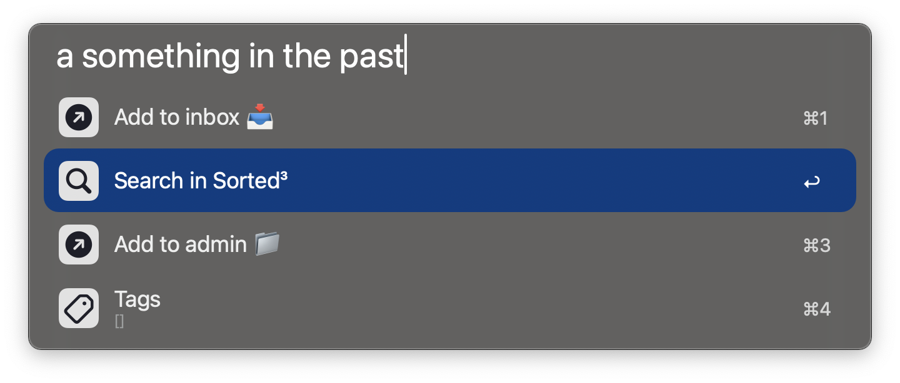

# AutoTagger for Alfred

`AutoTagger` allows you quickly run URL schemes while also automatically generating tags based on your query.

---
It features an inline YAML configuration for specifying tags and related terms, along with a customizable URL scheme using dynamic placeholders `[title]`, `[tags]`, and `[today]`, and is optimized for Sorted³ out of the box.

Tags are derived from the words in the query, with URLs being excluded. For usage examples, please refer to the unit tests in [tests.py](tests.py).

---

## 🚀 Features


### Supports auto tagging


### Support any number of URL Schemes



---

## 📖 Installation

### Step 1: Set up your Tags
```yaml
work 📁:
  - work
  - ios
  - pr

review 👀:
  - pr
  - doc
  - review

Card 💡:
  - create card

Important 🔺:
  - '!!'

```

### Step 2: Set up your URL Schemes
```yaml
- title: "Add to inbox 📥" 
  url: sorted://x-callback-url/add?title=[query]&tags=[tags]&date=[today]

- title: "Add to admin 📁" 
  url: sorted://x-callback-url/add?title=[query]&tags=[tags]&date=[today]&list=%F0%9F%93%81%20Admin

- title: "Search in Sorted³"
  url: sorted://x-callback-url/open?search=[query]
  icon: search.png

```

**Dyanmic variables:**
- `[query]`
- `[tags]`
- `[today]`

**Built in icons:**
- `tags.png`
- `search.png`


---

## 🛠️ Installation

1. Download [the latest workflow](https://github.com/jangelsb/auto-tagger-alfred-workflow/releases) and import it into Alfred. 
2. Configure the configs in the workflow settings
3. Enjoy & God bless!

