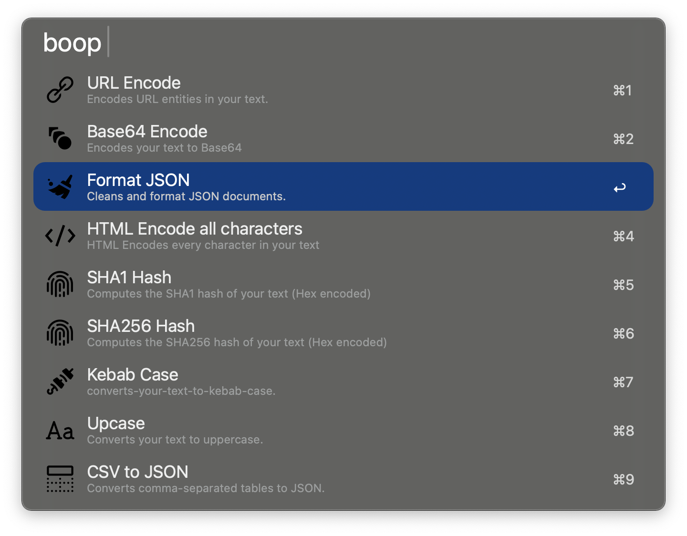

# Boop for Alfred

Based off of the widely popular https://github.com/IvanMathy/Boop

Quickly run string mutations using the text on your clipboard. This uses all the same scripts from Boop, even reading and parsing the metadata in each script.

This is as if Boop was made for Alfred.

---

## 🚀 Features

### Supports all the scripts from Boop

---

## 🛠️ Installation

1. Download [the latest workflow](TBD/releases) and import it into Alfred. 
2. Enjoy & God bless!

