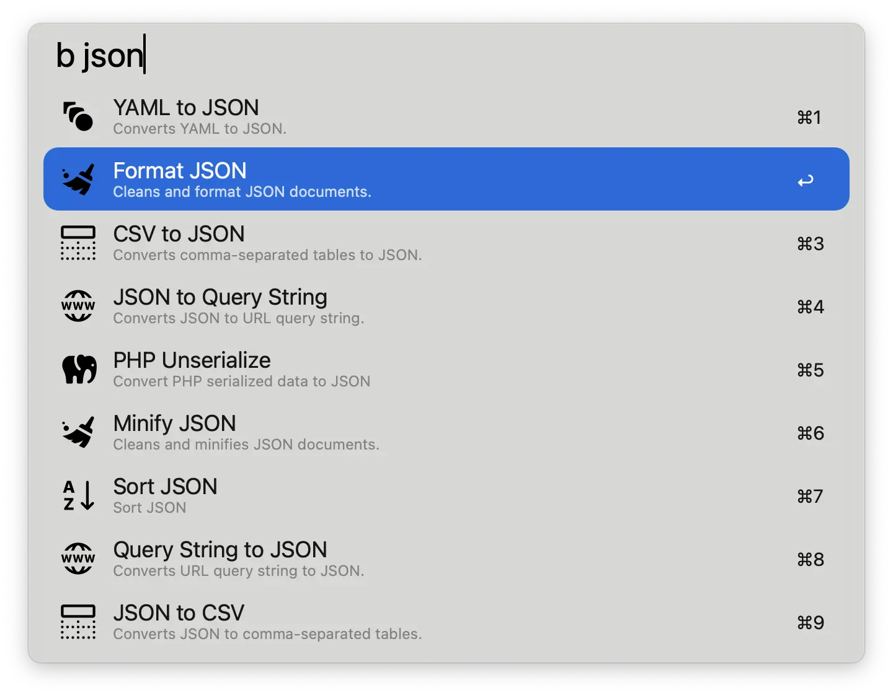

# Boop for Alfred

Based off of the widely popular https://github.com/IvanMathy/Boop

Quickly run string functions using the text on your clipboard. The output is then copied to your clipboard and pasted back into the editor.

This runs locally in Alfred, using all the same scripts from Boop. It even reads and parses the metadata in each script to allow sorting by the title and tags of a script.

*This is as if Boop were made for Alfred.*

---

## 🚀 Features

### Supports all the scripts from Boop

### Supports filtering based on tags

### Shows the input and output in Alfred

### Supports your own custom Boop scripts
* For more info see: https://github.com/IvanMathy/Boop/blob/main/Boop/Documentation/CustomScripts.md
* I have already included all the community scripts listed here (as of Thursday, Jan 23, 2025): https://github.com/IvanMathy/Boop/tree/main/Scripts

---

## 🛠️ Installation

1. Download [the latest workflow](https://github.com/jangelsb/boop-for-alfred-workflow/releases) and import it into Alfred. 
2. Enjoy & God bless!

---

## 📝 Version History

#### v2025.3
* Add the ability to view the change before commiting to it
* Press enter ⏎ to copy and paste the change
* Press escape ⎋ to cancel
* You can even manually copy part of it 

---

#### v2025.2
* Adds a small fix to strip only a single trailing new line from the output and not the entire output (the goal here is to avoid creating an additional newline, which seems to be added by default)

---

#### v2025.1
Initial Build

* Adds support for all scripts (default + community from Boop) -> code is ran exactly as it does in Boop but locally in Alfred
* Adds the ability to parse Boop script metadata
* Adds support for filter by Boop script names and tags
* Adds support for custom script folders

